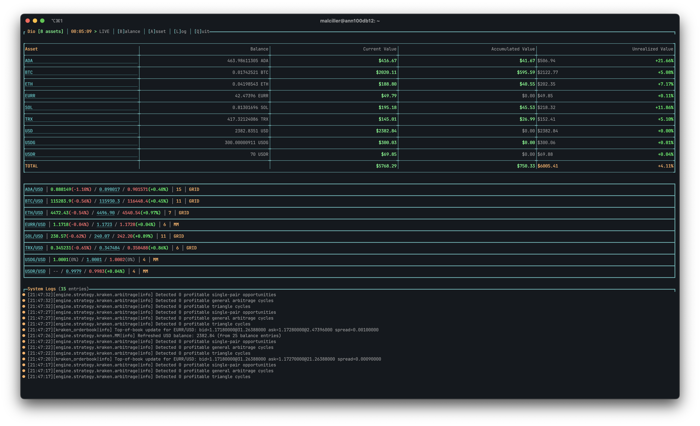
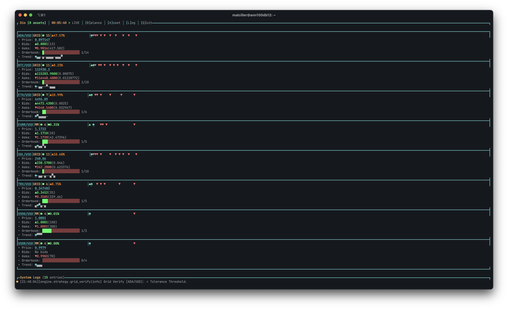
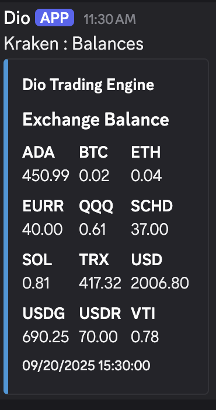
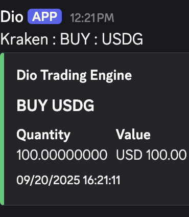
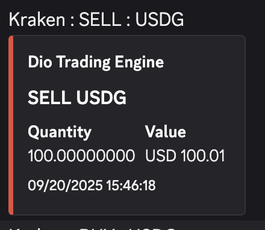

# Dio

[](https://ocaml.org/)
[](https://opensource.org/licenses/MIT)

OCaml trading engine for Kraken. Uses WebSocket and REST to run automated strategies with a terminal dashboard and optional Discord notifications.

## Requirements

- OCaml 4.14+ (opam)
- Kraken API key/secret
- macOS/Linux/WSL

## Quick Start

### Install
```bash
git clone https://github.com/malciller/dio.git
cd dio
opam install . --deps-only
dune build
```

### Configure
Create `.env`:
```bash
KRAKEN_API_KEY=your_kraken_api_key
KRAKEN_API_SECRET=your_kraken_api_secret
DISCORD_WEBHOOK_URL=your_discord_webhook_url
```

Edit `_config.json` (example):
```json
{
  "assets": [
    { "symbol": "BTC/USD",  // Pair to Trade
      "qty": "0.001",  // Base asset amount per trade
      "grid_interval": "1.0",  // Distance between buy and sell orders (profit spread)
      "sell_mult": "0.999", // Base asset amount sold multiplier (qty * sell_mult = sell order qty)
      "strategy": "Grid"  // Strategy Name (Grid/MM)
    },
    { "symbol": "USDT/USD",  // Pair to Trade
      "qty": "100.0",  // Base asset amount per trade
      "min_usd_balance": "500.0",  // Minimum USD balance for this pair and strategy to run
      "strategy": "GMM"  // Strategy Name (Grid/GMM/VMM)
     },
         { "symbol": "USDT/USD",  // Pair to Trade
      "qty": "100.0",  // Base asset amount per trade
      "max_exposure": "500.0",  // Maximum amount of asset to accumulate before pausing strategy
      "strategy": "VMM"  // Strategy Name (Grid/GMM/VMM)
     },
  ],
  "queues_cap": 1000,  // Maximum queue size allocated
  "profit_threshold_pct": 0.0010  // Relevant strategy profit threshold (percentage)
}
```

### Run
```bash
./_build/default/bin/dio.exe --dashboard   # with UI
./_build/default/bin/dio.exe               # headless
```

## Strategies

- GRID: Maintains buy/sell ladders around price with configurable spacing and size.
- GMM (Greedy Market Maker): Places buy and sell orders at the top bid and ask in the order book using fixed sizes. Does not account for fees or any profit threshold—simply quotes at the best available prices.
- VMM (Valley Market Maker): Places buy orders below the top ask, at a price that ensures the expressed profit margin and fee threshold are met. When a buy order is filled, it sells at the top ask when liquidity is present. Always accounts for fees and the configured profit margin.
- ARB: **Strategy runs automatically, does not require a config.** Finds triangle/longer cycles and single-pair spreads; sizes by liquidity and balances, runs for all assets active with other strategies.

## Architecture

- Engine: Orchestrates strategies and data flow.
- Router: Executes orders via Kraken (REST/WS) and manages auth.
- Feed: Streams market data via WebSocket.
- Dashboard: CLI for prices, orders, and logs.

## Dashboard
- Interactive Terminal Dashboard - Hotkeys to minimize each section.
  - B - Balance Widget
  - A - Asset Widget: Compact when Balance Widget open/Expanded when Balance Widget minimized
  - L - Log Widget
  - T - Telemetry

####  Compact Asset View
 

#### Expanded Asset View


## Notification
### Balance Updates


### Order Execution Alerts



## Development

```bash
# Build
dune build

# Tests
dune test

# Format / Docs
dune fmt
dune build @doc
```

## Logging

- Debug, Info, Warning, Error — timestamped by component.

## Contributing

1. Fork
2. Create branch (`git checkout -b feature/xyz`)
    - Trading logic found in src/dio_engine/trade_strategies/
3. Commit (`git commit -m "..."`)
4. Push (`git push origin feature/xyz`)
5. Open PR

Guidelines: add tests, update docs, keep CI green.

## License

MIT — see `LICENSE`.

Legal: Provided “as is”, without warranty. Trading involves risk.