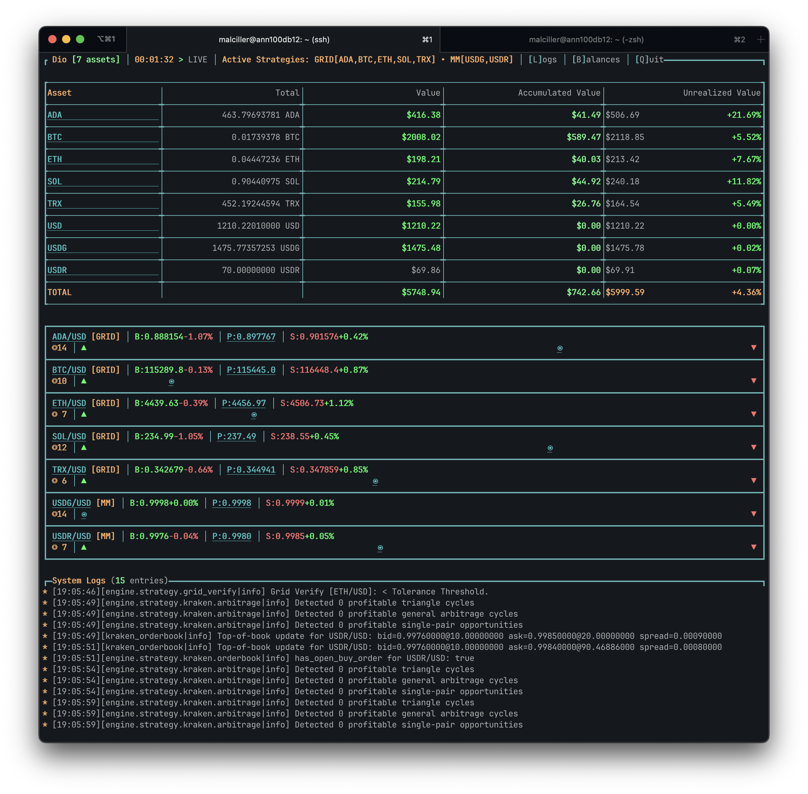

# Dio

[](https://ocaml.org/)
[](https://opensource.org/licenses/MIT)

An OCaml-based cryptocurrency trading engine for Kraken. It connects via WebSocket and REST APIs to execute automated trading strategies. 

## Features

- **Real-time Trading**: WebSocket connections for live price feeds and order execution.
- **Multiple Trading Strategies**: Grid, orderbook market making, and an arbitrage engine for multi-leg cycles and single-pair spreads.
- **Terminal Dashboard**: A CLI for price visualization and order tracking.
- **Discord Notification**: Order fulfillment notifications via Discord webhook.
- **Modular Architecture**: Separation between strategies, routing, and data feeds.
- **JSON Configuration**: Strategy configuration via JSON files.
- **Infrastructure**: Logging, error handling, and retry mechanisms.
- **Kraken Integration**: Manages authentication, order execution, and data feeds via REST and WebSocket APIs.

## Requirements

- **OCaml** 4.14+ with opam package manager
- **Kraken API** credentials (API key and secret)
- **Unix-like OS** (macOS, Linux, or WSL)

## Quick Start

### 1. Clone & Setup
```bash
git clone https://github.com/malciller/dio.git
cd dio
opam install . --deps-only
dune build
```

### 2. Environment Configuration
Create a `.env` file:
```bash
KRAKEN_API_KEY=your_kraken_api_key
KRAKEN_API_SECRET=your_kraken_api_secret
DISCORD_WEBHOOK_URL=your_discord_webhook_url 
```

### 3. Trading Configuration
Edit `_config.json`:
```json
{
  "assets": [
    {
      "symbol": "BTC/USD",
      "qty": "0.001",
      "grid_interval": "1.0",
      "sell_mult": "0.999",
      "strategy": "Grid"
    },    
    {
      "symbol": "USDT/USD",
      "qty": "100.0",
      "min_usd_balance": "500.0",
      "strategy": "Orderbook"
    }
  ],
  "queues_cap": 1000,
  "profit_threshold_pct": 0.0010
}
```

### 4. Launch
```bash
# With terminal dashboard
./_build/default/bin/dio.exe --dashboard

# Or headless mode
./_build/default/bin/dio.exe
```

## Trading Strategies

### Grid Strategy
Maintains a grid of buy and sell orders around the market price.
- **Adaptive Spacing**: Adjusts order distance based on market price movements.
- **Profit-Taking**: Configurable multipliers for sell orders.
- **Risk Management**: Configurable order quantities for position control.

### Orderbook Strategy
Places orders at the top of the orderbook bid/ask.
- **Top-of-Book**: Maintains orders at the best bid and ask.
- **Volume Management**: Uses fixed order quantities from configuration.

### Arbitrage Strategy
Detects and executes multi-leg arbitrage opportunities across different trading pairs. This strategy runs automatically on all assets defined in `_config.json` and does not need to be assigned to a specific asset.
- **Hybrid Cycle Detection**: Uses a fast triangle arbitrage algorithm and Bellman-Ford for longer cycles.
- **Spread Capture**: Identifies and trades profitable spreads on single pairs.
- **Liquidity Aware**: Calculates trade sizes based on available order book depth and current balances to minimize slippage and ensure execution.

## Architecture

```
┌─────────────────┐    ┌─────────────────┐    ┌─────────────────┐
│   CLI Dashboard │    │     Engine      │    │     Router      │
│                 │    │                 │    │                 │
│ • Real-time UI  │◄──►│ • Orchestration │◄──►│ • Order Mgmt    │
│ • Price Display │    │ • Buffer Mgmt   │    │ • Kraken API    │
│ • Order Status  │    │ • Strategy Exec │    │ • REST/WS       │
└─────────────────┘    └─────────────────┘    └─────────────────┘
         │                       │                       │
         └───────────────────────┼───────────────────────┘
                                 │
                    ┌─────────────────┐
                    │      Feed       │
                    │                 │
                    │ • Market Data   │
                    │ • WebSocket     │
                    │ • Price Updates │
                    └─────────────────┘
```

### Core Components

- **Engine**: Manages strategy execution and data flow.
- **Strategies**: Implementations of trading logic.
- **Router**: Handles order execution and Kraken API communication.
- **Feed**: Ingests market data from WebSockets.
- **Dashboard**: A CLI for monitoring.

## Configuration Reference

### Asset Configuration
```json
{
  "symbol": "BTC/USD",       // Trading pair
  "qty": "0.001",            // Base order quantity
  "grid_interval": "1.0",    // Grid spacing (%)
  "sell_mult": "0.999",      // Sell multiplier (< 1.0 = profit)
  "strategy": "Grid"         // Strategy name
},
{
  "symbol": "USDT/USD",      // Trading pair
  "qty": "100.0",             // Base order quantity
  "min_usd_balance": "500.0",  // Minimum USD balance threshold for strategy to run
  "strategy": "Orderbook"     // Strategy name
}
```

### System Configuration
```json
{
  "queues_cap": 1000,         // Buffer capacity
  "profit_threshold_pct": 0.0010   // profit threshold for arbitrage strategy to run
}
```

## Dashboard Interface

The terminal dashboard provides real-time monitoring:




**Key Features:**
- Real-time price ladders with order visualization
- Order status tracking and execution monitoring
- System logs and performance metrics

## Development

### Building
```bash
# Full build
dune build

# With tests
dune build @all

# Install locally
dune install
```

### Testing
```bash
# Run test suite
dune test

# Run specific tests
dune test src/dio_engine/test/
```

### Code Quality
```bash
# Format code
dune fmt

# Generate docs
dune build @doc
```

## Monitoring & Logging

Logs are categorized by level:

- **Debug**: Detailed execution tracing
- **Info**: Strategy decisions and order executions
- **Warning**: Recoverable errors and rate limit hits
- **Error**: Critical failures requiring attention

Logs are timestamped and categorized by component.

## Risk Management

**CRITICAL**: This software is for educational and research purposes only.

### Important Warnings
- **Financial Risk**: Cryptocurrency trading involves substantial risk of loss
- **API Limits**: Respect exchange rate limits to avoid account restrictions
- **Testing**: Always test strategies with minimal capital first
- **Monitoring**: Never run unattended without proper monitoring
- **Backup**: Maintain separate emergency funds

### Best Practices
- Start with small position sizes
- Implement proper stop-loss mechanisms
- Monitor API usage and account balances
- Keep multiple backup configurations

## Contributing

We welcome contributions! Please:

1. Fork the repository
2. Create a feature branch (`git checkout -b feature/amazing-feature`)
3. Commit changes (`git commit -m 'Add amazing feature'`)
4. Push to branch (`git push origin feature/amazing-feature`)
5. Open a Pull Request

### Development Guidelines
- Add tests for new functionality
- Update documentation
- Ensure CI passes

## Acknowledgments

- [OCaml](https://ocaml.org/)
- [LWT](https://github.com/ocsigen/lwt) for concurrency

## Support & Contact

- **Issues**: [GitHub Issues](https://github.com/malciller/dio/issues)
- **Discussions**: [GitHub Discussions](https://github.com/malciller/dio/discussions)

## License
- This project is licensed under the MIT license. Please see LICENSE file for details.

**Legal Disclaimer**: This software is provided "as is" without warranty. The authors are not responsible for any financial losses, damages, or other liabilities arising from its use. Always consult with financial professionals before engaging in cryptocurrency trading.